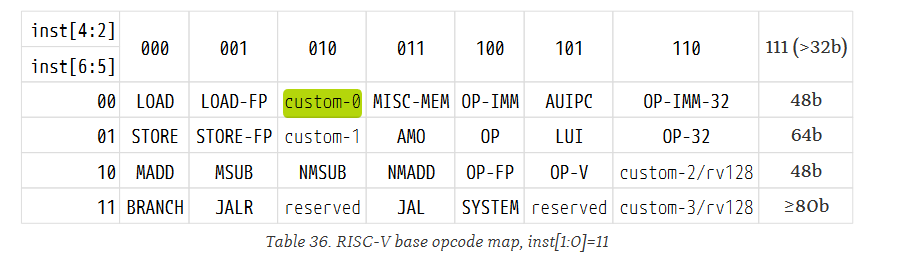

# QM-XC7A35T移植E203-Hbirdv2

文件夹介绍：

.
|-- README.md     ---------- 介绍文件
|-- cpu_constructmarkdown-img
|   |-- cpu_construct.assets
|   -- image-20231212213309068.png
|-- e203_nuclei_studio    ----------  e203的nuclei_studio工程
|   |-- Debug
|   |-- application
|   |-- hbird_sdk
|   -- test_e203hbridv2_debug_openocd.launch
|-- e203_tools   ---------- e203的开发工具
|   |-- riscv-opcodes
|     -- riscv_toolschain
-- e203_vivado       ---------- e203的vivado工程
    |-- test_e203.cache
    |-- test_e203.gen
    |-- test_e203.hw
    |-- test_e203.ioplanning
    |-- test_e203.ip_user_files
    |-- test_e203.runs
    |-- test_e203.sim
    |-- test_e203.srcs
    |-- test_e203.xpr
    |-- vivado.jou
    -- vivado.log

#### 1、构建选择软硬件

##### soc(tinyrisc-v)


##### soc(Hummingbirdv2 E203)


##### fpga：xc7a35T


#### 2、代码阅读

##### tinyriscv顶层文件

```verilog
module tinyriscv_soc_top(

    input wire clk,
    input wire rst,

    output reg over,         // 测试是否完成信号
    output reg succ,         // 测试是否成功信号

    output wire halted_ind,  // jtag是否已经halt住CPU信号

    input wire uart_debug_pin, // 串口下载使能引脚

    output wire uart_tx_pin, // UART发送引脚
    input wire uart_rx_pin,  // UART接收引脚
    inout wire[1:0] gpio,    // GPIO引脚

    input wire jtag_TCK,     // JTAG TCK引脚
    input wire jtag_TMS,     // JTAG TMS引脚
    input wire jtag_TDI,     // JTAG TDI引脚
    output wire jtag_TDO,    // JTAG TDO引脚

    input wire spi_miso,     // SPI MISO引脚
    output wire spi_mosi,    // SPI MOSI引脚
    output wire spi_ss,      // SPI SS引脚
    output wire spi_clk      // SPI CLK引脚

    );

```

##### tinyriscv代码结构


##### tinyriscv结构


```verilog
module tinyriscv(

    input wire clk,
    input wire rst,

    output wire[`MemAddrBus] rib_ex_addr_o,    // 读、写外设的地址
    input wire[`MemBus] rib_ex_data_i,         // 从外设读取的数据
    output wire[`MemBus] rib_ex_data_o,        // 写入外设的数据
    output wire rib_ex_req_o,                  // 访问外设请求
    output wire rib_ex_we_o,                   // 写外设标志

    output wire[`MemAddrBus] rib_pc_addr_o,    // 取指地址
    input wire[`MemBus] rib_pc_data_i,         // 取到的指令内容

    input wire[`RegAddrBus] jtag_reg_addr_i,   // jtag模块读、写寄存器的地址
    input wire[`RegBus] jtag_reg_data_i,       // jtag模块写寄存器数据
    input wire jtag_reg_we_i,                  // jtag模块写寄存器标志
    output wire[`RegBus] jtag_reg_data_o,      // jtag模块读取到的寄存器数据

    input wire rib_hold_flag_i,                // 总线暂停标志
    input wire jtag_halt_flag_i,               // jtag暂停标志
    input wire jtag_reset_flag_i,              // jtag复位PC标志

    input wire[`INT_BUS] int_i                 // 中断信号

    );

    
tinyriscv u_tinyriscv(
        .clk(clk),
        .rst(rst),
        .rib_ex_addr_o(m0_addr_i),
        .rib_ex_data_i(m0_data_o),
        .rib_ex_data_o(m0_data_i),
        .rib_ex_req_o(m0_req_i),
        .rib_ex_we_o(m0_we_i),

        .rib_pc_addr_o(m1_addr_i),
        .rib_pc_data_i(m1_data_o),

        .jtag_reg_addr_i(jtag_reg_addr_o),
        .jtag_reg_data_i(jtag_reg_data_o),
        .jtag_reg_we_i(jtag_reg_we_o),
        .jtag_reg_data_o(jtag_reg_data_i),

        .rib_hold_flag_i(rib_hold_flag_o),
        .jtag_halt_flag_i(jtag_halt_req_o),
        .jtag_reset_flag_i(jtag_reset_req_o),

        .int_i(int_flag)
    );
```


##### e203_hbirdv2结构


#### 3、程序编写SDK

##### 1、tinyriscv

##### makefile  调用common.mk

```makefile
RISCV_ARCH := rv32im
RISCV_ABI := ilp32
RISCV_MCMODEL := medlow


TARGET = gpio


#CFLAGS += -DSIMULATION
#CFLAGS += -O2
#ASM_SRCS +=
#LDFLAGS +=
#INCLUDES += -I.

C_SRCS := \
	main.c \


COMMON_DIR = ..
TOOLCHAIN_DIR = ../../..
include ../common.mk

```


##### common.mk 设置工具链

```makefile

RISCV_PATH := $(TOOLCHAIN_DIR)/tools/gnu-mcu-eclipse-riscv-none-gcc-8.2.0-2.2-20190521-0004-win64/

RISCV_GCC     := $(abspath $(RISCV_PATH)/bin/riscv-none-embed-gcc)
RISCV_AS      := $(abspath $(RISCV_PATH)/bin/riscv-none-embed-as)
RISCV_GXX     := $(abspath $(RISCV_PATH)/bin/riscv-none-embed-g++)
RISCV_OBJDUMP := $(abspath $(RISCV_PATH)/bin/riscv-none-embed-objdump)
RISCV_GDB     := $(abspath $(RISCV_PATH)/bin/riscv-none-embed-gdb)
RISCV_AR      := $(abspath $(RISCV_PATH)/bin/riscv-none-embed-ar)
RISCV_OBJCOPY := $(abspath $(RISCV_PATH)/bin/riscv-none-embed-objcopy)
RISCV_READELF := $(abspath $(RISCV_PATH)/bin/riscv-none-embed-readelf)

.PHONY: all
all: $(TARGET)

ASM_SRCS += $(COMMON_DIR)/start.S
ASM_SRCS += $(COMMON_DIR)/trap_entry.S
C_SRCS += $(COMMON_DIR)/init.c
C_SRCS += $(COMMON_DIR)/trap_handler.c
C_SRCS += $(COMMON_DIR)/lib/utils.c
C_SRCS += $(COMMON_DIR)/lib/xprintf.c
C_SRCS += $(COMMON_DIR)/lib/uart.c
C_SRCS += $(COMMON_DIR)/lib/flash_n25q.c
C_SRCS += $(COMMON_DIR)/lib/spi.c

LINKER_SCRIPT := $(COMMON_DIR)/link.lds

INCLUDES += -I$(COMMON_DIR)

LDFLAGS += -T $(LINKER_SCRIPT) -nostartfiles -Wl,--gc-sections -Wl,--check-sections

ASM_OBJS := $(ASM_SRCS:.S=.o)
C_OBJS := $(C_SRCS:.c=.o)

LINK_OBJS += $(ASM_OBJS) $(C_OBJS)
LINK_DEPS += $(LINKER_SCRIPT)

CLEAN_OBJS += $(TARGET) $(LINK_OBJS) $(TARGET).dump $(TARGET).bin

CFLAGS += -march=$(RISCV_ARCH)
CFLAGS += -mabi=$(RISCV_ABI)
CFLAGS += -mcmodel=$(RISCV_MCMODEL) -ffunction-sections -fdata-sections -fno-builtin-printf -fno-builtin-malloc

$(TARGET): $(LINK_OBJS) $(LINK_DEPS) Makefile
	$(RISCV_GCC) $(CFLAGS) $(INCLUDES) $(LINK_OBJS) -o $@ $(LDFLAGS)
	$(RISCV_OBJCOPY) -O binary $@ $@.bin
	$(RISCV_OBJDUMP) --disassemble-all $@ > $@.dump

$(ASM_OBJS): %.o: %.S
	$(RISCV_GCC) $(CFLAGS) $(INCLUDES) -c -o $@ $<

$(C_OBJS): %.o: %.c
	$(RISCV_GCC) $(CFLAGS) $(INCLUDES) -c -o $@ $<

.PHONY: clean
clean:
	rm -f $(CLEAN_OBJS)

```

##### make log

```makefile
/home/ubuntu/Desktop/code/tinyriscv/tinyriscv/tools/gnu-mcu-eclipse/riscv-none-gcc/8.2.0-2.2-20190521-0004/bin/riscv-none-embed-gcc -march=rv32im -mabi=ilp32 -mcmodel=medlow -ffunction-sections -fdata-sections -fno-builtin-printf -fno-builtin-malloc -I.. -c -o ../start.o ../start.S

/home/ubuntu/Desktop/code/tinyriscv/tinyriscv/tools/gnu-mcu-eclipse/riscv-none-gcc/8.2.0-2.2-20190521-0004/bin/riscv-none-embed-gcc -march=rv32im -mabi=ilp32 -mcmodel=medlow -ffunction-sections -fdata-sections -fno-builtin-printf -fno-builtin-malloc -I.. -c -o ../trap_entry.o ../trap_entry.S

/home/ubuntu/Desktop/code/tinyriscv/tinyriscv/tools/gnu-mcu-eclipse/riscv-none-gcc/8.2.0-2.2-20190521-0004/bin/riscv-none-embed-gcc -march=rv32im -mabi=ilp32 -mcmodel=medlow -ffunction-sections -fdata-sections -fno-builtin-printf -fno-builtin-malloc -I.. -c -o main.o main.c

/home/ubuntu/Desktop/code/tinyriscv/tinyriscv/tools/gnu-mcu-eclipse/riscv-none-gcc/8.2.0-2.2-20190521-0004/bin/riscv-none-embed-gcc -march=rv32im -mabi=ilp32 -mcmodel=medlow -ffunction-sections -fdata-sections -fno-builtin-printf -fno-builtin-malloc -I.. -c -o ../init.o ../init.c

/home/ubuntu/Desktop/code/tinyriscv/tinyriscv/tools/gnu-mcu-eclipse/riscv-none-gcc/8.2.0-2.2-20190521-0004/bin/riscv-none-embed-gcc -march=rv32im -mabi=ilp32 -mcmodel=medlow -ffunction-sections -fdata-sections -fno-builtin-printf -fno-builtin-malloc -I.. -c -o ../trap_handler.o ../trap_handler.c

/home/ubuntu/Desktop/code/tinyriscv/tinyriscv/tools/gnu-mcu-eclipse/riscv-none-gcc/8.2.0-2.2-20190521-0004/bin/riscv-none-embed-gcc -march=rv32im -mabi=ilp32 -mcmodel=medlow -ffunction-sections -fdata-sections -fno-builtin-printf -fno-builtin-malloc -I.. -c -o ../lib/utils.o ../lib/utils.c

/home/ubuntu/Desktop/code/tinyriscv/tinyriscv/tools/gnu-mcu-eclipse/riscv-none-gcc/8.2.0-2.2-20190521-0004/bin/riscv-none-embed-gcc -march=rv32im -mabi=ilp32 -mcmodel=medlow -ffunction-sections -fdata-sections -fno-builtin-printf -fno-builtin-malloc -I.. -c -o ../lib/xprintf.o ../lib/xprintf.c

/home/ubuntu/Desktop/code/tinyriscv/tinyriscv/tools/gnu-mcu-eclipse/riscv-none-gcc/8.2.0-2.2-20190521-0004/bin/riscv-none-embed-gcc -march=rv32im -mabi=ilp32 -mcmodel=medlow -ffunction-sections -fdata-sections -fno-builtin-printf -fno-builtin-malloc -I.. -c -o ../lib/uart.o ../lib/uart.c

/home/ubuntu/Desktop/code/tinyriscv/tinyriscv/tools/gnu-mcu-eclipse/riscv-none-gcc/8.2.0-2.2-20190521-0004/bin/riscv-none-embed-gcc -march=rv32im -mabi=ilp32 -mcmodel=medlow -ffunction-sections -fdata-sections -fno-builtin-printf -fno-builtin-malloc -I.. -c -o ../lib/flash_n25q.o ../lib/flash_n25q.c

/home/ubuntu/Desktop/code/tinyriscv/tinyriscv/tools/gnu-mcu-eclipse/riscv-none-gcc/8.2.0-2.2-20190521-0004/bin/riscv-none-embed-gcc -march=rv32im -mabi=ilp32 -mcmodel=medlow -ffunction-sections -fdata-sections -fno-builtin-printf -fno-builtin-malloc -I.. -c -o ../lib/spi.o ../lib/spi.c

/home/ubuntu/Desktop/code/tinyriscv/tinyriscv/tools/gnu-mcu-eclipse/riscv-none-gcc/8.2.0-2.2-20190521-0004/bin/riscv-none-embed-gcc -march=rv32im -mabi=ilp32 -mcmodel=medlow -ffunction-sections -fdata-sections -fno-builtin-printf -fno-builtin-malloc -I.. ../start.o ../trap_entry.o main.o ../init.o ../trap_handler.o ../lib/utils.o ../lib/xprintf.o ../lib/uart.o ../lib/flash_n25q.o ../lib/spi.o -o gpio -T ../link.lds -nostartfiles -Wl,--gc-sections -Wl,--check-sections

/home/ubuntu/Desktop/code/tinyriscv/tinyriscv/tools/gnu-mcu-eclipse/riscv-none-gcc/8.2.0-2.2-20190521-0004/bin/riscv-none-embed-objcopy -O binary gpio gpio.bin

/home/ubuntu/Desktop/code/tinyriscv/tinyriscv/tools/gnu-mcu-eclipse/riscv-none-gcc/8.2.0-2.2-20190521-0004/bin/riscv-none-embed-objdump --disassemble-all gpio > gpio.dump

```


##### link.ld

```assembly
OUTPUT_ARCH( "riscv" )
ENTRY(_start)


MEMORY
{
  flash (wxa!ri) : ORIGIN = 0x00000000, LENGTH = 16K
  ram (wxa!ri) :   ORIGIN = 0x10000000, LENGTH = 16K
}


SECTIONS
{
   __stack_size = DEFINED(__stack_size) ? __stack_size : 8K;

  .init           :
  {
    KEEP (*(SORT_NONE(.init)))
  } >flash AT>flash 

  .text           :
  {
    *(.text.unlikely .text.unlikely.*)
    *(.text.startup .text.startup.*)
    *(.text .text.*)
    *(.gnu.linkonce.t.*)
  } >flash AT>flash 

  . = ALIGN(4);

  PROVIDE (__etext = .);
  PROVIDE (_etext = .);
  PROVIDE (etext = .);

  .preinit_array  :
  {
    PROVIDE_HIDDEN (__preinit_array_start = .);
    KEEP (*(.preinit_array))
    PROVIDE_HIDDEN (__preinit_array_end = .);
  } >flash AT>flash 

  .init_array     :
  {
    PROVIDE_HIDDEN (__init_array_start = .);
    KEEP (*(SORT_BY_INIT_PRIORITY(.init_array.*) SORT_BY_INIT_PRIORITY(.ctors.*)))
    KEEP (*(.init_array EXCLUDE_FILE (*crtbegin.o *crtbegin?.o *crtend.o *crtend?.o ) .ctors))
    PROVIDE_HIDDEN (__init_array_end = .);
  } >flash AT>flash 

  .fini_array     :
  {
    PROVIDE_HIDDEN (__fini_array_start = .);
    KEEP (*(SORT_BY_INIT_PRIORITY(.fini_array.*) SORT_BY_INIT_PRIORITY(.dtors.*)))
    KEEP (*(.fini_array EXCLUDE_FILE (*crtbegin.o *crtbegin?.o *crtend.o *crtend?.o ) .dtors))
    PROVIDE_HIDDEN (__fini_array_end = .);
  } >flash AT>flash 

  .ctors          :
  {
    /* gcc uses crtbegin.o to find the start of
       the constructors, so we make sure it is
       first.  Because this is a wildcard, it
       doesn't matter if the user does not
       actually link against crtbegin.o; the
       linker won't look for a file to match a
       wildcard.  The wildcard also means that it
       doesn't matter which directory crtbegin.o
       is in.  */
    KEEP (*crtbegin.o(.ctors))
    KEEP (*crtbegin?.o(.ctors))
    /* We don't want to include the .ctor section from
       the crtend.o file until after the sorted ctors.
       The .ctor section from the crtend file contains the
       end of ctors marker and it must be last */
    KEEP (*(EXCLUDE_FILE (*crtend.o *crtend?.o ) .ctors))
    KEEP (*(SORT(.ctors.*)))
    KEEP (*(.ctors))
  } >flash AT>flash 

  .dtors          :
  {
    KEEP (*crtbegin.o(.dtors))
    KEEP (*crtbegin?.o(.dtors))
    KEEP (*(EXCLUDE_FILE (*crtend.o *crtend?.o ) .dtors))
    KEEP (*(SORT(.dtors.*)))
    KEEP (*(.dtors))
  } >flash AT>flash 

  .lalign         :
  {
    . = ALIGN(4);
    PROVIDE( _data_lma = . );
  } >flash AT>flash 

  .dalign         :
  {
    . = ALIGN(4);
    PROVIDE( _data = . );
  } >ram AT>flash 

  .data          :
  {
    *(.rdata)
    *(.rodata .rodata.*)
    *(.gnu.linkonce.r.*)
    *(.data .data.*)
    *(.gnu.linkonce.d.*)
    . = ALIGN(8);
    PROVIDE( __global_pointer$ = . + 0x800 );
    *(.sdata .sdata.*)
    *(.gnu.linkonce.s.*)
    . = ALIGN(8);
    *(.srodata.cst16)
    *(.srodata.cst8)
    *(.srodata.cst4)
    *(.srodata.cst2)
    *(.srodata .srodata.*)
  } >ram AT>flash 

  . = ALIGN(4);
  PROVIDE( _edata = . );
  PROVIDE( edata = . );

  PROVIDE( _fbss = . );
  PROVIDE( __bss_start = . );
  .bss            :
  {
    *(.sbss*)
    *(.gnu.linkonce.sb.*)
    *(.bss .bss.*)
    *(.gnu.linkonce.b.*)
    *(COMMON)
    . = ALIGN(4);
  } >ram AT>ram 

  . = ALIGN(8);
  PROVIDE( _end = . );
  PROVIDE( end = . );

  .stack ORIGIN(ram) + LENGTH(ram) - __stack_size :
  {
    PROVIDE( _heap_end = . );
    . = __stack_size;
    PROVIDE( _sp = . );
    __freertos_irq_stack_top = .;
  } >ram AT>ram

}

```

##### start.s  初始化data和bss   next进入init 初始化中断 next进入main

```assembly

    .section .init;
    .globl _start;
    .type _start,@function


_start:
.option push
.option norelax
	la gp, __global_pointer$
.option pop
	la sp, _sp
#ifdef SIMULATION
    li x26, 0x00
    li x27, 0x00
#endif

	/* Load data section */
	la a0, _data_lma
	la a1, _data
	la a2, _edata
	bgeu a1, a2, 2f
1:
	lw t0, (a0)
	sw t0, (a1)
	addi a0, a0, 4
	addi a1, a1, 4
	bltu a1, a2, 1b
2:

	/* Clear bss section */
	la a0, __bss_start
	la a1, _end
	bgeu a0, a1, 2f
1:
	sw zero, (a0)
	addi a0, a0, 4
	bltu a0, a1, 1b
2:

    call _init
    call main

#ifdef SIMULATION
    li x26, 0x01
#endif

loop:
    j loop

```

##### init.c  设置中断入口函数trap_entry.s

```c
#include <stdint.h>

#include "include/utils.h"


extern void trap_entry();


void _init()
{
    // 设置中断入口函数
    write_csr(mtvec, &trap_entry);
    // 使能CPU全局中断
    // MIE = 1, MPIE = 1, MPP = 11
    write_csr(mstatus, 0x1888);
}

```


##### trap_entry.s   保护现场  跳转中断函数trap_handler  打回现场

```assembly
#define REGBYTES  4
#define STORE     sw
#define LOAD      lw


    .section      .text.entry	
    .align 2
    .global trap_entry
trap_entry:

    addi sp, sp, -32*REGBYTES

    STORE x1, 1*REGBYTES(sp)
    STORE x2, 2*REGBYTES(sp)
    STORE x3, 3*REGBYTES(sp)
    STORE x4, 4*REGBYTES(sp)
    STORE x5, 5*REGBYTES(sp)
    STORE x6, 6*REGBYTES(sp)
    STORE x7, 7*REGBYTES(sp)
    STORE x8, 8*REGBYTES(sp)
    STORE x9, 9*REGBYTES(sp)
    STORE x10, 10*REGBYTES(sp)
    STORE x11, 11*REGBYTES(sp)
    STORE x12, 12*REGBYTES(sp)
    STORE x13, 13*REGBYTES(sp)
    STORE x14, 14*REGBYTES(sp)
    STORE x15, 15*REGBYTES(sp)
    STORE x16, 16*REGBYTES(sp)
    STORE x17, 17*REGBYTES(sp)
    STORE x18, 18*REGBYTES(sp)
    STORE x19, 19*REGBYTES(sp)
    STORE x20, 20*REGBYTES(sp)
    STORE x21, 21*REGBYTES(sp)
    STORE x22, 22*REGBYTES(sp)
    STORE x23, 23*REGBYTES(sp)
    STORE x24, 24*REGBYTES(sp)
    STORE x25, 25*REGBYTES(sp)
#ifndef SIMULATION
    STORE x26, 26*REGBYTES(sp)
    STORE x27, 27*REGBYTES(sp)
#endif
    STORE x28, 28*REGBYTES(sp)
    STORE x29, 29*REGBYTES(sp)
    STORE x30, 30*REGBYTES(sp)
    STORE x31, 31*REGBYTES(sp)

    csrr a0, mcause
    csrr a1, mepc
test_if_asynchronous:
	srli a2, a0, 31		                /* MSB of mcause is 1 if handing an asynchronous interrupt - shift to LSB to clear other bits. */
	beq a2, x0, handle_synchronous		/* Branch past interrupt handing if not asynchronous. */

    call trap_handler
    j asynchronous_return

handle_synchronous:
    addi a1, a1, 4
    csrw mepc, a1

asynchronous_return:
    LOAD x1, 1*REGBYTES(sp)
    LOAD x2, 2*REGBYTES(sp)
    LOAD x3, 3*REGBYTES(sp)
    LOAD x4, 4*REGBYTES(sp)
    LOAD x5, 5*REGBYTES(sp)
    LOAD x6, 6*REGBYTES(sp)
    LOAD x7, 7*REGBYTES(sp)
    LOAD x8, 8*REGBYTES(sp)
    LOAD x9, 9*REGBYTES(sp)
    LOAD x10, 10*REGBYTES(sp)
    LOAD x11, 11*REGBYTES(sp)
    LOAD x12, 12*REGBYTES(sp)
    LOAD x13, 13*REGBYTES(sp)
    LOAD x14, 14*REGBYTES(sp)
    LOAD x15, 15*REGBYTES(sp)
    LOAD x16, 16*REGBYTES(sp)
    LOAD x17, 17*REGBYTES(sp)
    LOAD x18, 18*REGBYTES(sp)
    LOAD x19, 19*REGBYTES(sp)
    LOAD x20, 20*REGBYTES(sp)
    LOAD x21, 21*REGBYTES(sp)
    LOAD x22, 22*REGBYTES(sp)
    LOAD x23, 23*REGBYTES(sp)
    LOAD x24, 24*REGBYTES(sp)
    LOAD x25, 25*REGBYTES(sp)
#ifndef SIMULATION
    LOAD x26, 26*REGBYTES(sp)
    LOAD x27, 27*REGBYTES(sp)
#endif
    LOAD x28, 28*REGBYTES(sp)
    LOAD x29, 29*REGBYTES(sp)
    LOAD x30, 30*REGBYTES(sp)
    LOAD x31, 31*REGBYTES(sp)

    addi sp, sp, 32*REGBYTES

    mret


.weak trap_handler
trap_handler:
1:
    j 1b

```


##### gpio  main.c  设置gpio寄存器

```c
#include <stdint.h>

#include "../include/gpio.h"
#include "../include/utils.h"


int main()
{
    GPIO_REG(GPIO_CTRL) |= 0x1;       // gpio0输出模式
    GPIO_REG(GPIO_CTRL) |= 0x1 << 3;  // gpio1输入模式

    while (1) {
        // 如果GPIO1输入高
        if (GPIO_REG(GPIO_DATA) & 0x2)
            GPIO_REG(GPIO_DATA) |= 0x1;  // GPIO0输出高
        // 如果GPIO1输入低
        else
            GPIO_REG(GPIO_DATA) &= ~0x1; // GPIO0输出低
    }
}

```


##### gpio.dump

```assembly

gpio:     file format elf32-littleriscv


Disassembly of section .init:

00000000 <_start>:
   0:	10001197          	auipc	gp,0x10001
   4:	80018193          	addi	gp,gp,-2048 # 10000800 <__global_pointer$>
   8:	10004117          	auipc	sp,0x10004
   c:	ff810113          	addi	sp,sp,-8 # 10004000 <__freertos_irq_stack_top>
  10:	28000513          	li	a0,640
  14:	10000597          	auipc	a1,0x10000
  18:	fec58593          	addi	a1,a1,-20 # 10000000 <__bss_start>
  1c:	10000617          	auipc	a2,0x10000
  20:	fe460613          	addi	a2,a2,-28 # 10000000 <__bss_start>
  24:	00c5fc63          	bgeu	a1,a2,3c <_start+0x3c>
  28:	00052283          	lw	t0,0(a0)
  2c:	0055a023          	sw	t0,0(a1)
  30:	00450513          	addi	a0,a0,4
  34:	00458593          	addi	a1,a1,4
  38:	fec5e8e3          	bltu	a1,a2,28 <_start+0x28>
  3c:	10000517          	auipc	a0,0x10000
  40:	fc450513          	addi	a0,a0,-60 # 10000000 <__bss_start>
  44:	10000597          	auipc	a1,0x10000
  48:	fbc58593          	addi	a1,a1,-68 # 10000000 <__bss_start>
  4c:	00b57863          	bgeu	a0,a1,5c <_start+0x5c>
  50:	00052023          	sw	zero,0(a0)
  54:	00450513          	addi	a0,a0,4
  58:	feb56ce3          	bltu	a0,a1,50 <_start+0x50>
  5c:	1bc000ef          	jal	ra,218 <_init>
  60:	130000ef          	jal	ra,190 <main>

00000064 <loop>:
  64:	0000006f          	j	64 <loop>

Disassembly of section .text:

00000068 <trap_entry>:
  68:	f8010113          	addi	sp,sp,-128
  6c:	00112223          	sw	ra,4(sp)
  70:	00212423          	sw	sp,8(sp)
  74:	00312623          	sw	gp,12(sp)
  78:	00412823          	sw	tp,16(sp)
  7c:	00512a23          	sw	t0,20(sp)
  80:	00612c23          	sw	t1,24(sp)
  84:	00712e23          	sw	t2,28(sp)
  88:	02812023          	sw	s0,32(sp)
  8c:	02912223          	sw	s1,36(sp)
  90:	02a12423          	sw	a0,40(sp)
  94:	02b12623          	sw	a1,44(sp)
  98:	02c12823          	sw	a2,48(sp)
  9c:	02d12a23          	sw	a3,52(sp)
  a0:	02e12c23          	sw	a4,56(sp)
  a4:	02f12e23          	sw	a5,60(sp)
  a8:	05012023          	sw	a6,64(sp)
  ac:	05112223          	sw	a7,68(sp)
  b0:	05212423          	sw	s2,72(sp)
  b4:	05312623          	sw	s3,76(sp)
  b8:	05412823          	sw	s4,80(sp)
  bc:	05512a23          	sw	s5,84(sp)
  c0:	05612c23          	sw	s6,88(sp)
  c4:	05712e23          	sw	s7,92(sp)
  c8:	07812023          	sw	s8,96(sp)
  cc:	07912223          	sw	s9,100(sp)
  d0:	07a12423          	sw	s10,104(sp)
  d4:	07b12623          	sw	s11,108(sp)
  d8:	07c12823          	sw	t3,112(sp)
  dc:	07d12a23          	sw	t4,116(sp)
  e0:	07e12c23          	sw	t5,120(sp)
  e4:	07f12e23          	sw	t6,124(sp)
  e8:	34202573          	csrr	a0,mcause
  ec:	341025f3          	csrr	a1,mepc

000000f0 <test_if_asynchronous>:
  f0:	01f55613          	srli	a2,a0,0x1f
  f4:	00060663          	beqz	a2,100 <handle_synchronous>
  f8:	154000ef          	jal	ra,24c <trap_handler>
  fc:	00c0006f          	j	108 <asynchronous_return>

00000100 <handle_synchronous>:
 100:	00458593          	addi	a1,a1,4
 104:	34159073          	csrw	mepc,a1

00000108 <asynchronous_return>:
 108:	00412083          	lw	ra,4(sp)
 10c:	00812103          	lw	sp,8(sp)
 110:	00c12183          	lw	gp,12(sp)
 114:	01012203          	lw	tp,16(sp)
 118:	01412283          	lw	t0,20(sp)
 11c:	01812303          	lw	t1,24(sp)
 120:	01c12383          	lw	t2,28(sp)
 124:	02012403          	lw	s0,32(sp)
 128:	02412483          	lw	s1,36(sp)
 12c:	02812503          	lw	a0,40(sp)
 130:	02c12583          	lw	a1,44(sp)
 134:	03012603          	lw	a2,48(sp)
 138:	03412683          	lw	a3,52(sp)
 13c:	03812703          	lw	a4,56(sp)
 140:	03c12783          	lw	a5,60(sp)
 144:	04012803          	lw	a6,64(sp)
 148:	04412883          	lw	a7,68(sp)
 14c:	04812903          	lw	s2,72(sp)
 150:	04c12983          	lw	s3,76(sp)
 154:	05012a03          	lw	s4,80(sp)
 158:	05412a83          	lw	s5,84(sp)
 15c:	05812b03          	lw	s6,88(sp)
 160:	05c12b83          	lw	s7,92(sp)
 164:	06012c03          	lw	s8,96(sp)
 168:	06412c83          	lw	s9,100(sp)
 16c:	06812d03          	lw	s10,104(sp)
 170:	06c12d83          	lw	s11,108(sp)
 174:	07012e03          	lw	t3,112(sp)
 178:	07412e83          	lw	t4,116(sp)
 17c:	07812f03          	lw	t5,120(sp)
 180:	07c12f83          	lw	t6,124(sp)
 184:	08010113          	addi	sp,sp,128
 188:	30200073          	mret
 18c:	0000006f          	j	18c <asynchronous_return+0x84>

00000190 <main>:
 190:	ff010113          	addi	sp,sp,-16
 194:	00812623          	sw	s0,12(sp)
 198:	01010413          	addi	s0,sp,16
 19c:	400007b7          	lui	a5,0x40000
 1a0:	0007a703          	lw	a4,0(a5) # 40000000 <__freertos_irq_stack_top+0x2fffc000>
 1a4:	400007b7          	lui	a5,0x40000
 1a8:	00176713          	ori	a4,a4,1
 1ac:	00e7a023          	sw	a4,0(a5) # 40000000 <__freertos_irq_stack_top+0x2fffc000>
 1b0:	400007b7          	lui	a5,0x40000
 1b4:	0007a703          	lw	a4,0(a5) # 40000000 <__freertos_irq_stack_top+0x2fffc000>
 1b8:	400007b7          	lui	a5,0x40000
 1bc:	00876713          	ori	a4,a4,8
 1c0:	00e7a023          	sw	a4,0(a5) # 40000000 <__freertos_irq_stack_top+0x2fffc000>
 1c4:	400007b7          	lui	a5,0x40000
 1c8:	00478793          	addi	a5,a5,4 # 40000004 <__freertos_irq_stack_top+0x2fffc004>
 1cc:	0007a783          	lw	a5,0(a5)
 1d0:	0027f793          	andi	a5,a5,2
 1d4:	02078263          	beqz	a5,1f8 <main+0x68>
 1d8:	400007b7          	lui	a5,0x40000
 1dc:	00478793          	addi	a5,a5,4 # 40000004 <__freertos_irq_stack_top+0x2fffc004>
 1e0:	0007a703          	lw	a4,0(a5)
 1e4:	400007b7          	lui	a5,0x40000
 1e8:	00478793          	addi	a5,a5,4 # 40000004 <__freertos_irq_stack_top+0x2fffc004>
 1ec:	00176713          	ori	a4,a4,1
 1f0:	00e7a023          	sw	a4,0(a5)
 1f4:	fd1ff06f          	j	1c4 <main+0x34>
 1f8:	400007b7          	lui	a5,0x40000
 1fc:	00478793          	addi	a5,a5,4 # 40000004 <__freertos_irq_stack_top+0x2fffc004>
 200:	0007a703          	lw	a4,0(a5)
 204:	400007b7          	lui	a5,0x40000
 208:	00478793          	addi	a5,a5,4 # 40000004 <__freertos_irq_stack_top+0x2fffc004>
 20c:	ffe77713          	andi	a4,a4,-2
 210:	00e7a023          	sw	a4,0(a5)
 214:	fb1ff06f          	j	1c4 <main+0x34>

00000218 <_init>:
 218:	ff010113          	addi	sp,sp,-16
 21c:	00812623          	sw	s0,12(sp)
 220:	01010413          	addi	s0,sp,16
 224:	000007b7          	lui	a5,0x0
 228:	06878793          	addi	a5,a5,104 # 68 <trap_entry>
 22c:	30579073          	csrw	mtvec,a5
 230:	000027b7          	lui	a5,0x2
 234:	88878793          	addi	a5,a5,-1912 # 1888 <_data_lma+0x1608>
 238:	30079073          	csrw	mstatus,a5
 23c:	00000013          	nop
 240:	00c12403          	lw	s0,12(sp)
 244:	01010113          	addi	sp,sp,16
 248:	00008067          	ret

0000024c <trap_handler>:
 24c:	fe010113          	addi	sp,sp,-32
 250:	00112e23          	sw	ra,28(sp)
 254:	00812c23          	sw	s0,24(sp)
 258:	02010413          	addi	s0,sp,32
 25c:	fea42623          	sw	a0,-20(s0)
 260:	feb42423          	sw	a1,-24(s0)
 264:	00000097          	auipc	ra,0x0
 268:	000000e7          	jalr	zero # 0 <_start>
 26c:	00000013          	nop
 270:	01c12083          	lw	ra,28(sp)
 274:	01812403          	lw	s0,24(sp)
 278:	02010113          	addi	sp,sp,32
 27c:	00008067          	ret

Disassembly of section .stack:

10002000 <__freertos_irq_stack_top-0x2000>:
	...

Disassembly of section .comment:

00000000 <.comment>:
   0:	3a434347          	fmsub.d	ft6,ft6,ft4,ft7,rmm
   4:	2820                	fld	fs0,80(s0)
   6:	20554e47          	fmsub.s	ft8,fa0,ft5,ft4,rmm
   a:	434d                	li	t1,19
   c:	2055                	jal	b0 <trap_entry+0x48>
   e:	6345                	lui	t1,0x11
  10:	696c                	flw	fa1,84(a0)
  12:	7370                	flw	fa2,100(a4)
  14:	2065                	jal	bc <trap_entry+0x54>
  16:	4952                	lw	s2,20(sp)
  18:	562d4353          	0x562d4353
  1c:	4520                	lw	s0,72(a0)
  1e:	626d                	lui	tp,0x1b
  20:	6465                	lui	s0,0x19
  22:	6564                	flw	fs1,76(a0)
  24:	2064                	fld	fs1,192(s0)
  26:	2c434347          	0x2c434347
  2a:	3620                	fld	fs0,104(a2)
  2c:	2d34                	fld	fa3,88(a0)
  2e:	6962                	flw	fs2,24(sp)
  30:	2974                	fld	fa3,208(a0)
  32:	3820                	fld	fs0,112(s0)
  34:	322e                	fld	ft4,232(sp)
  36:	302e                	fld	ft0,232(sp)
	...

```

##### 

##### 2、fpga移植 hbirdv2

根据开发板上晶振改为50MHZ,删去CLK32768KHZ引脚改为50M分频出CLK32768KHZ


```verilog
module divclk
	#(
	parameter N=488)
	(
	input clk,
	input rstn,
	output clk_out,
	//output wire [3:0] cnt,
	//output reg odd_clk_out1,
	o//utput reg odd_clk_out2
	);

	//even
	reg [30:0] even_cnt;
	reg   	  even_clk_out;

	always@(posedge clk, negedge rstn)	begin
		if(!rstn)
			even_cnt <= 1'b0;
		else if(even_cnt == (N>>1'b1)-1'b1)
			even_cnt <= 1'b0;
		else
			even_cnt <= even_cnt + 1'b1;
	end

	always@(posedge clk, negedge rstn)	begin
		if(!rstn)
			even_clk_out <= 1'b0;
		else if(even_cnt == (N>>1'b1)-1'b1)
			even_clk_out <= ~even_clk_out;
		else
			even_clk_out <= even_clk_out;
	end
	
	//odd
	reg [30:0] odd_cnt;
	reg 	  odd_clk_out1;
	reg	  odd_clk_out2;
	wire 	  odd_clk_out;

	always@(posedge clk, negedge rstn)	begin
		if(!rstn)
			odd_cnt <= 1'b0;
		else if(odd_cnt == N-1'b1)
			odd_cnt <= 1'b0;
		else
			odd_cnt <= odd_cnt + 1'b1;
	end

	always@(posedge clk, negedge rstn)	begin
		if(!rstn)
			odd_clk_out1 <= 1'b0;
		else if(odd_cnt == N>>1'b1 | odd_cnt == 1'b0)
			odd_clk_out1 <= ~odd_clk_out1;
		else
			odd_clk_out1 <= odd_clk_out1;
	end

	always@(negedge clk, negedge rstn)	begin
		if(!rstn)
			odd_clk_out2 <= 1'b0;
		else if(odd_cnt == (N>>1'b1)+1'b1 | odd_cnt == 1'b1)
			odd_clk_out2 <= ~odd_clk_out2;
		else
			odd_clk_out2 <= odd_clk_out2;
	end
	
	assign odd_clk_out = odd_clk_out1 | odd_clk_out2;
	assign clk_out = (N%2==0) ? even_clk_out : odd_clk_out;
	//assign cnt = (N%2==0) ? even_cnt : odd_cnt;

endmodule

```


设置  dut_io_pads_bootrom_n_i_ival为0代表从ram中启动


在e203_define中添加


之后约束文件添加

```c
set_property PACKAGE_PIN E6 [get_ports {gpioA[0]}]
set_property PACKAGE_PIN R2 [get_ports {gpioA[1]}]
set_property PACKAGE_PIN M5 [get_ports {gpioA[2]}]
set_property PACKAGE_PIN P4 [get_ports {gpioA[3]}]
set_property PACKAGE_PIN T15 [get_ports {gpioA[4]}]
set_property PACKAGE_PIN P14 [get_ports {gpioA[5]}]
set_property PACKAGE_PIN R13 [get_ports {gpioA[6]}]
set_property PACKAGE_PIN R12 [get_ports {gpioA[7]}]
set_property PACKAGE_PIN N12 [get_ports {gpioA[8]}]
set_property PACKAGE_PIN K13 [get_ports {gpioA[9]}]
set_property PACKAGE_PIN P11 [get_ports {gpioA[10]}]
set_property PACKAGE_PIN P9 [get_ports {gpioA[11]}]
set_property PACKAGE_PIN R11 [get_ports {gpioA[12]}]
set_property PACKAGE_PIN R10 [get_ports {gpioA[13]}]
set_property PACKAGE_PIN R8 [get_ports {gpioA[14]}]
set_property PACKAGE_PIN R7 [get_ports {gpioA[15]}]
set_property PACKAGE_PIN R6 [get_ports {gpioA[16]}]
set_property PACKAGE_PIN R5 [get_ports {gpioA[17]}]
set_property PACKAGE_PIN M6 [get_ports {gpioA[18]}]
set_property PACKAGE_PIN P5 [get_ports {gpioA[19]}]
set_property PACKAGE_PIN T3 [get_ports {gpioA[20]}]
set_property PACKAGE_PIN T2 [get_ports {gpioA[21]}]
set_property PACKAGE_PIN R1 [get_ports {gpioA[22]}]
set_property PACKAGE_PIN N4 [get_ports {gpioA[23]}]
set_property PACKAGE_PIN P3 [get_ports {gpioA[24]}]
set_property PACKAGE_PIN P1 [get_ports {gpioA[25]}]
set_property PACKAGE_PIN M1 [get_ports {gpioA[26]}]
set_property PACKAGE_PIN M12 [get_ports {gpioA[27]}]
set_property PACKAGE_PIN N14 [get_ports {gpioA[28]}]
set_property PACKAGE_PIN P15 [get_ports {gpioA[29]}]
set_property PACKAGE_PIN R15 [get_ports {gpioA[30]}]
set_property PACKAGE_PIN T14 [get_ports {gpioA[31]}]

set_property PACKAGE_PIN A7 [get_ports {gpioB[0]}]
set_property PACKAGE_PIN B5 [get_ports {gpioB[1]}]
set_property PACKAGE_PIN J4 [get_ports {gpioB[3]}]
set_property PACKAGE_PIN G4 [get_ports {gpioB[4]}]
set_property PACKAGE_PIN C6 [get_ports {gpioB[5]}]
set_property PACKAGE_PIN D5 [get_ports {gpioB[6]}]
set_property PACKAGE_PIN A4 [get_ports {gpioB[7]}]
set_property PACKAGE_PIN A3 [get_ports {gpioB[8]}]
set_property PACKAGE_PIN C4 [get_ports {gpioB[9]}]
set_property PACKAGE_PIN C2 [get_ports {gpioB[10]}]
set_property PACKAGE_PIN A2 [get_ports {gpioB[11]}]
set_property PACKAGE_PIN B1 [get_ports {gpioB[12]}]
set_property PACKAGE_PIN D1 [get_ports {gpioB[13]}]
set_property PACKAGE_PIN D3 [get_ports {gpioB[14]}]
set_property PACKAGE_PIN E5 [get_ports {gpioB[15]}]
set_property PACKAGE_PIN E1 [get_ports {gpioB[16]}]
set_property PACKAGE_PIN F3 [get_ports {gpioB[17]}]
set_property PACKAGE_PIN G1 [get_ports {gpioB[18]}]
set_property PACKAGE_PIN H1 [get_ports {gpioB[19]}]
set_property PACKAGE_PIN J1 [get_ports {gpioB[20]}]
set_property PACKAGE_PIN L2 [get_ports {gpioB[21]}]
set_property PACKAGE_PIN H4 [get_ports {gpioB[22]}]
set_property PACKAGE_PIN H3 [get_ports {gpioB[23]}]
set_property PACKAGE_PIN K2 [get_ports {gpioB[24]}]
set_property PACKAGE_PIN M4 [get_ports {gpioB[25]}]
set_property PACKAGE_PIN N2 [get_ports {gpioB[26]}]
set_property PACKAGE_PIN B7 [get_ports {gpioB[27]}]
set_property PACKAGE_PIN B6 [get_ports {gpioB[28]}]
set_property PACKAGE_PIN J5 [get_ports {gpioB[30]}]
set_property PACKAGE_PIN G5 [get_ports {gpioB[31]}]


set_property IOSTANDARD LVCMOS33 [get_ports {gpioA[31]}]
set_property IOSTANDARD LVCMOS33 [get_ports {gpioA[30]}]
set_property IOSTANDARD LVCMOS33 [get_ports {gpioA[29]}]
set_property IOSTANDARD LVCMOS33 [get_ports {gpioA[28]}]
set_property IOSTANDARD LVCMOS33 [get_ports {gpioA[27]}]
set_property IOSTANDARD LVCMOS33 [get_ports {gpioA[26]}]
set_property IOSTANDARD LVCMOS33 [get_ports {gpioA[25]}]
set_property IOSTANDARD LVCMOS33 [get_ports {gpioA[24]}]
set_property IOSTANDARD LVCMOS33 [get_ports {gpioA[23]}]
set_property IOSTANDARD LVCMOS33 [get_ports {gpioA[22]}]
set_property IOSTANDARD LVCMOS33 [get_ports {gpioA[21]}]
set_property IOSTANDARD LVCMOS33 [get_ports {gpioA[20]}]
set_property IOSTANDARD LVCMOS33 [get_ports {gpioA[19]}]
set_property IOSTANDARD LVCMOS33 [get_ports {gpioA[18]}]
set_property IOSTANDARD LVCMOS33 [get_ports {gpioA[17]}]
set_property IOSTANDARD LVCMOS33 [get_ports {gpioA[16]}]
set_property IOSTANDARD LVCMOS33 [get_ports {gpioA[15]}]
set_property IOSTANDARD LVCMOS33 [get_ports {gpioA[14]}]
set_property IOSTANDARD LVCMOS33 [get_ports {gpioA[13]}]
set_property IOSTANDARD LVCMOS33 [get_ports {gpioA[12]}]
set_property IOSTANDARD LVCMOS33 [get_ports {gpioA[11]}]
set_property IOSTANDARD LVCMOS33 [get_ports {gpioA[10]}]
set_property IOSTANDARD LVCMOS33 [get_ports {gpioA[9]}]
set_property IOSTANDARD LVCMOS33 [get_ports {gpioA[8]}]
set_property IOSTANDARD LVCMOS33 [get_ports {gpioA[7]}]
set_property IOSTANDARD LVCMOS33 [get_ports {gpioA[6]}]
set_property IOSTANDARD LVCMOS33 [get_ports {gpioA[5]}]
set_property IOSTANDARD LVCMOS33 [get_ports {gpioA[4]}]
set_property IOSTANDARD LVCMOS33 [get_ports {gpioA[3]}]
set_property IOSTANDARD LVCMOS33 [get_ports {gpioA[2]}]
set_property IOSTANDARD LVCMOS33 [get_ports {gpioA[1]}]
set_property IOSTANDARD LVCMOS33 [get_ports {gpioA[0]}]
set_property IOSTANDARD LVCMOS33 [get_ports {gpioB[31]}]
set_property IOSTANDARD LVCMOS33 [get_ports {gpioB[30]}]
set_property IOSTANDARD LVCMOS33 [get_ports {gpioB[29]}]
set_property IOSTANDARD LVCMOS33 [get_ports {gpioB[28]}]
set_property IOSTANDARD LVCMOS33 [get_ports {gpioB[27]}]
set_property IOSTANDARD LVCMOS33 [get_ports {gpioB[26]}]
set_property IOSTANDARD LVCMOS33 [get_ports {gpioB[25]}]
set_property IOSTANDARD LVCMOS33 [get_ports {gpioB[24]}]
set_property IOSTANDARD LVCMOS33 [get_ports {gpioB[23]}]
set_property IOSTANDARD LVCMOS33 [get_ports {gpioB[22]}]
set_property IOSTANDARD LVCMOS33 [get_ports {gpioB[21]}]
set_property IOSTANDARD LVCMOS33 [get_ports {gpioB[20]}]
set_property IOSTANDARD LVCMOS33 [get_ports {gpioB[19]}]
set_property IOSTANDARD LVCMOS33 [get_ports {gpioB[18]}]
set_property IOSTANDARD LVCMOS33 [get_ports {gpioB[17]}]
set_property IOSTANDARD LVCMOS33 [get_ports {gpioB[16]}]
set_property IOSTANDARD LVCMOS33 [get_ports {gpioB[15]}]
set_property IOSTANDARD LVCMOS33 [get_ports {gpioB[14]}]
set_property IOSTANDARD LVCMOS33 [get_ports {gpioB[13]}]
set_property IOSTANDARD LVCMOS33 [get_ports {gpioB[12]}]
set_property IOSTANDARD LVCMOS33 [get_ports {gpioB[11]}]
set_property IOSTANDARD LVCMOS33 [get_ports {gpioB[10]}]
set_property IOSTANDARD LVCMOS33 [get_ports {gpioB[9]}]
set_property IOSTANDARD LVCMOS33 [get_ports {gpioB[8]}]
set_property IOSTANDARD LVCMOS33 [get_ports {gpioB[7]}]
set_property IOSTANDARD LVCMOS33 [get_ports {gpioB[6]}]
set_property IOSTANDARD LVCMOS33 [get_ports {gpioB[5]}]
set_property IOSTANDARD LVCMOS33 [get_ports {gpioB[4]}]
set_property IOSTANDARD LVCMOS33 [get_ports {gpioB[3]}]
set_property IOSTANDARD LVCMOS33 [get_ports {gpioB[2]}]
set_property IOSTANDARD LVCMOS33 [get_ports {gpioB[1]}]
set_property IOSTANDARD LVCMOS33 [get_ports {gpioB[0]}]
set_property IOSTANDARD LVCMOS33 [get_ports {qspi0_dq[3]}]
set_property IOSTANDARD LVCMOS33 [get_ports {qspi0_dq[2]}]
set_property IOSTANDARD LVCMOS33 [get_ports {qspi0_dq[1]}]
set_property IOSTANDARD LVCMOS33 [get_ports {qspi0_dq[0]}]

set_property PACKAGE_PIN N11 [get_ports CLK50MHZ]
set_property IOSTANDARD LVCMOS33 [get_ports CLK50MHZ]
set_property PULLUP true [get_ports fpga_rst]
set_property PULLUP true [get_ports mcu_rst]
set_property IOSTANDARD LVCMOS33 [get_ports fpga_rst]
set_property IOSTANDARD LVCMOS33 [get_ports mcu_rst]
set_property PACKAGE_PIN K5 [get_ports mcu_rst]
set_property PACKAGE_PIN P13 [get_ports fpga_rst]
set_property PACKAGE_PIN N13 [get_ports mcu_TCK]
set_property PACKAGE_PIN N16 [get_ports mcu_TDI]
set_property PACKAGE_PIN P16 [get_ports mcu_TDO]
set_property PACKAGE_PIN R16 [get_ports mcu_TMS]

create_clock -add -name sys_clk_pin -period 20.00 -waveform {0 5} [get_ports {CLK50MHZ}];


#set_property CLOCK_DEDICATED_ROUTE FALSE [get_nets dut_io_pads_jtag_TCK_i_ival]
#set_property CLOCK_DEDICATED_ROUTE FALSE [get_nets IOBUF_jtag_TCK/O]
set_property KEEPER true [get_ports mcu_TMS]
set_property PACKAGE_PIN M2 [get_ports mcu_wakeup]
set_property PACKAGE_PIN R3 [get_ports pmu_paden]
set_property PACKAGE_PIN T4 [get_ports pmu_padrst]
set_property PACKAGE_PIN L5 [get_ports qspi0_cs]
set_property PACKAGE_PIN N6 [get_ports qspi0_sck]
set_property PACKAGE_PIN P6 [get_ports {qspi0_dq[3]}]
set_property PACKAGE_PIN T5 [get_ports {qspi0_dq[2]}]
set_property PACKAGE_PIN T7 [get_ports {qspi0_dq[1]}]
set_property PACKAGE_PIN T8 [get_ports {qspi0_dq[0]}]
set_property PACKAGE_PIN C7 [get_ports {gpioB[2]}]
set_property IOSTANDARD LVCMOS33 [get_ports mcu_TCK]
set_property IOSTANDARD LVCMOS33 [get_ports mcu_TDI]
set_property IOSTANDARD LVCMOS33 [get_ports mcu_TDO]
set_property IOSTANDARD LVCMOS33 [get_ports mcu_TMS]
set_property IOSTANDARD LVCMOS33 [get_ports pmu_paden]
set_property IOSTANDARD LVCMOS33 [get_ports mcu_wakeup]
set_property IOSTANDARD LVCMOS33 [get_ports pmu_padrst]
set_property IOSTANDARD LVCMOS33 [get_ports qspi0_cs]
set_property IOSTANDARD LVCMOS33 [get_ports qspi0_sck]
set_property PULLUP true [get_ports mcu_wakeup]
set_property PACKAGE_PIN D6 [get_ports {gpioB[29]}]


#####         SPI Configurate Setting        #######
set_property BITSTREAM.CONFIG.SPI_BUSWIDTH 4 [current_design] 
set_property CONFIG_MODE SPIx4 [current_design] 
set_property BITSTREAM.CONFIG.CONFIGRATE 50 [current_design]


```


#### 4、工具链构成

##### 环境：wsl2+ubuntu 20.04


#####  gnu risc工具链


##### qemu


#### 5、修改汇编器

参考：[如何往binutils中加入一条riscv指令 | 骏的世界 (lujun.org.cn)](http://www.lujun.org.cn/?p=4466)

##### RISCV指令格式




##### 自定义指令格式

选用custom-3 rv32格式


R type


| name      | 31-25fun7 | 24-20RS2 | 19-15RS1 | 14-12fun3 | 11-7rd | 6-0 opcode |
| --------- | --------- | -------- | -------- | --------- | ------ | ---------- |
| aes.encsm | 00000xx   |          |          | 000       |        | 1111011    |
| aes.encs  | 00001xx   |          |          | 000       |        | 1111011    |
| aes.decsm | 00010xx   |          |          | 000       |        | 1111011    |
| aes.decs  | 00011xx   |          |          | 000       |        | 1111011    |
| sm4.ed    | 00100xx   |          |          | 000       |        | 1111011    |
| sm4.ks    | 00101xx   |          |          | 000       |        | 1111011    |


##### **通过git clone github.com/riscv/riscv-opcodes.git生成**

增加 make gen 


增加opt_user文件


```c
#define MATCH_AES_ENCS 0x800007b
#define MASK_AES_ENCS 0xfe00707f
#define MATCH_AES_ENCSM 0x7b
#define MASK_AES_ENCSM 0xfe00707f

DECLARE_INSN(aes_encs, MATCH_AES_ENCS, MASK_AES_ENCS)
DECLARE_INSN(aes_encsm, MATCH_AES_ENCSM, MASK_AES_ENCSM)
```

```c
aes.encsm  rd rs1 rs2 31..25=0b0000000 14..12=0 6..2=0b11110 1..0=3
aes.encs  rd rs1 rs2 31..25=0b0000100 14..12=0 6..2=0b11110 1..0=3
```

##### 将文件添加到binutils源代码中使用make -j4生成

{"aes.encsm", 0, INSN_CLASS_I, "d,s,t", MATCH_AES_ENCSM, MASK_AES_ENCSM, match_opcode, 0},

{"aes.encs", 0, INSN_CLASS_I, "d,s,t", MATCH_AES_ENCS, MASK_AES_ENCS, match_opcode, 0},

添加到I指令集


riscv-opc.h


##### 测试


#### 7、实践操作

##### 一、编译工程(tinyriscv  make)


##### 二、烧录代码(tinyriscv 文档中可见)

将CMSIS-DAP调试器连接好FPGA板子和PC电脑。

打开一个CMD窗口，然后cd进入到tinyriscv项目的tools/openocd目录，执行命令：


```c
openocd.exe -f tinyriscv.cfg
```

如果执行成功的话则会如下图所示：


然后打开另一个CMD窗口，执行以下命令来连接openocd，注意电脑要启用telnet host服务。

```c
telnet localhost 4444
```


然后在这个CMD窗口下使用load_image命令将固件下载到FPGA，这里以freertos.bin文件为例，如下所示：

```c
load_image D:/files/learning/papers/cpu_riscv/paper/riscv_cpu_constuct/riscv_toolschain/tinyriscv_bin/gpio.bin 0x0 bin 0x0 0x1000000
```

load_image D:/files/learning/papers/cpu_riscv/paper/riscv_cpu_constuct/riscv_toolschain/tinyriscv_bin/uart_tx.bin 0x0 bin 0x0 0x1000000


使用verify_image命令来校验是否下载成功，如下所示：

```c
verify_image D:/files/learning/papers/cpu_riscv/paper/riscv_cpu_constuct/riscv_toolschain/tinyriscv_bin/gpio.bin 0x0 
```

如果下载出错的话会有提示的，没有提示则说明下载成功。

最后执行以下命令让程序跑起来：

```c
resume 0
```

**注意：每次下载程序前记得先执行halt命令停住CPU。**


串口烧录方式

D:

cd D:\files\learning\papers\cpu_riscv\paper\riscv_cpu_constuct\riscv_toolschain\tools

python tinyriscv_fw_downloader.py COM11 D:\files\learning\papers\cpu_riscv\paper\riscv_cpu_constuct\riscv_toolschain\tinyriscv_bin\gpio.bin

python tinyriscv_fw_downloader.py COM11 D:\files\learning\papers\cpu_riscv\paper\riscv_cpu_constuct\riscv_toolschain\tinyriscv_bin\uart_tx.bin

##### 三、编译工程(e203_hbirdv2)

使用nuclei studio 


设置中添加如下代码生成bin文件


riscv-nuclei-elf-objcopy -O binary test_e203hbridv2.elf   test_e203hbridv2.bin


##### 四、烧录代码(e203_hbridv2)

添加新的openocd cfg文件

```bash
adapter_khz     1000

#reset_config srst_only
#adapter_nsrst_assert_width 100

interface cmsis-dap


transport select jtag


set _ENDIAN little

set _CHIPNAME riscv
jtag newtap $_CHIPNAME cpu -irlen 5

set _TARGETNAME $_CHIPNAME.cpu
target create $_TARGETNAME riscv -chain-position $_TARGETNAME
$_TARGETNAME configure -work-area-phys 0x80000000 -work-area-size 10000 -work-area-backup 1


riscv expose_csrs 770-800,835-850,1984-2032,2064-2070


adapter_nsrst_delay 100
jtag_ntrst_delay 100


init

halt
```


执行以下两个bat

```bash
copy D:\code\mcu\nucleistudio_Projects\test_e203hbridv2\Debug\test_e203hbridv2.bin D:\files\learning\papers\cpu_riscv\paper\riscv_cpu_constuct\riscv_toolschain\e203_hbirdv2_bin\
cd D:\files\learning\papers\cpu_riscv\paper\riscv_cpu_constuct\riscv_toolschain\tools\openocd
openocd.exe -f openocd_hbirdv2.cfg
```

```bash

telnet localhost 4444
```

执行以下代码

```
load_image D:/files/learning/papers/cpu_riscv/paper/riscv_cpu_constuct/riscv_toolschain/e203_hbirdv2_bin/test_e203hbridv2.bin 0x80000000


resume 0x80000000
```

现象


#### 8、工程移植详细步骤参考

[[E203移植\]一---vivado移植FPGA工程 - 哔哩哔哩 (bilibili.com)](https://www.bilibili.com/read/cv28485185/)

[[E203移植\]二---使用Nuclei Studio开发，使用cmsis-dap烧录 - 哔哩哔哩 (bilibili.com)](https://www.bilibili.com/read/cv28484104/)
