# algr算法

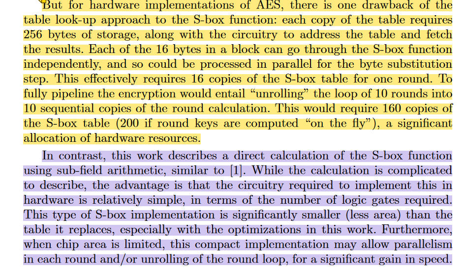


##### sub-field arithmetic

##### 有限域原理(伽罗瓦域)


#### 1、sbox仿真(aes)

参考文档：

##### D. Canright, 《A Very Compact S-Box for AES》, 收入 *Cryptographic Hardware and Embedded Systems – CHES 2005*, 卷 3659, J. R. Rao和B. Sunar, 编, 收入 Lecture Notes in Computer Science, vol. 3659. , Berlin, Heidelberg: Springer Berlin Heidelberg, 2005, 页 441–455. doi: [10.1007/11545262_32](https://doi.org/10.1007/11545262_32).

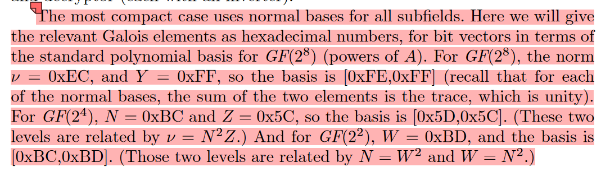

[AES 和 SM4 S盒复合域实现方法 (osr-tech.com)](https://osr-tech.com/technical-information-show-81.html)

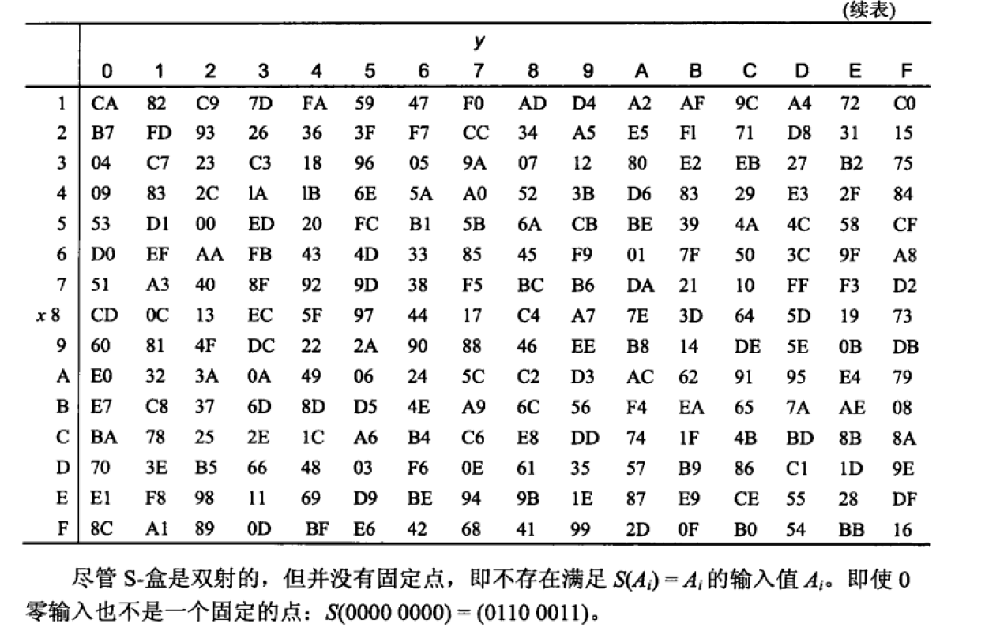


##### testbench

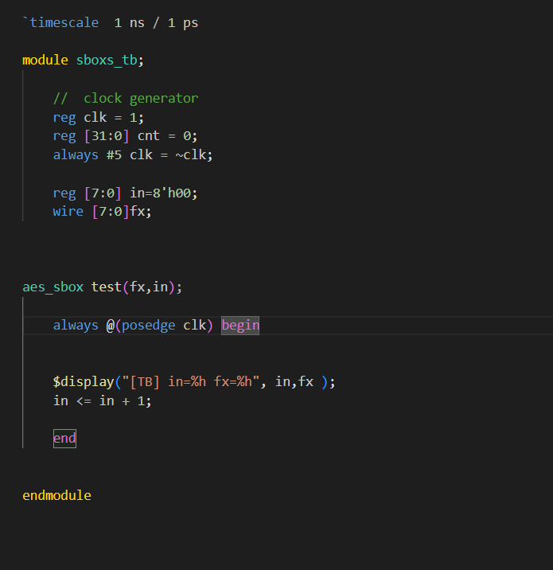

##### modelsim输出

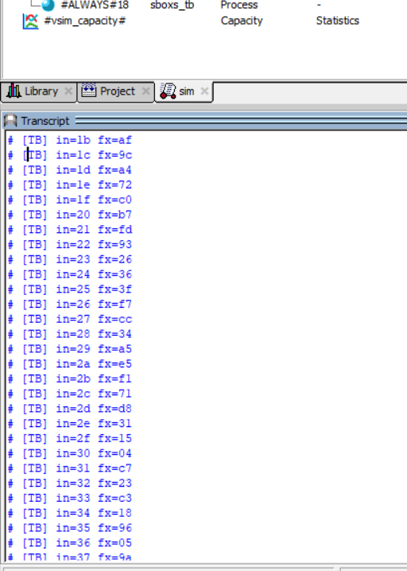


#### 2、sbox仿真(sm4)中国对称加密标准


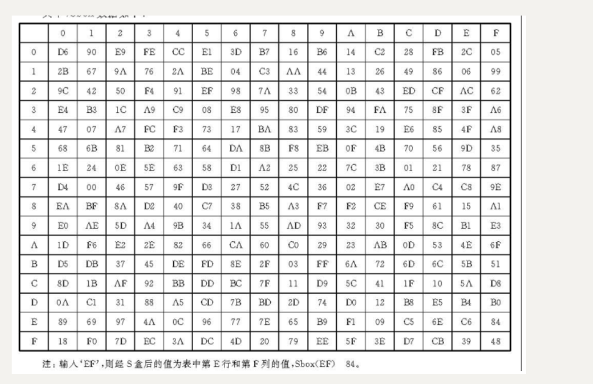

##### modelsim输出

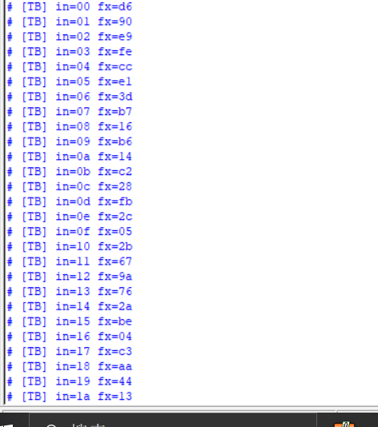

#### 3、multiply 0x02 乘法 xtime运用(有限域乘法 分配法化简运算)

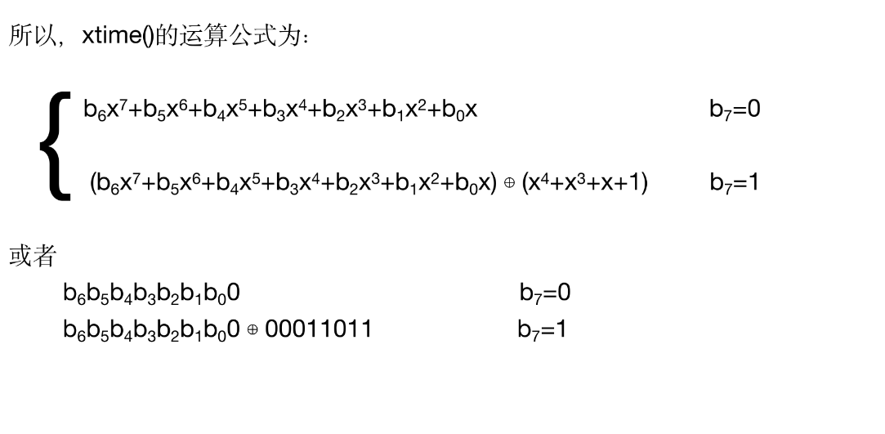


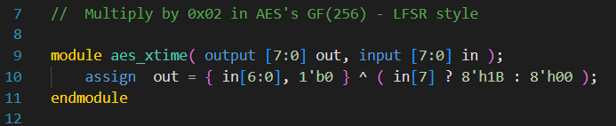

##### 作用：简化运算

#### 4、运行逻辑

##### step1 :选择哪一个8位数据


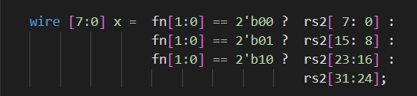

##### step2 :进入sbox  fn[2]判断是否为最后一轮

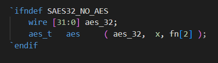

##### step3: 四次轮回进行 mixcolumn操作

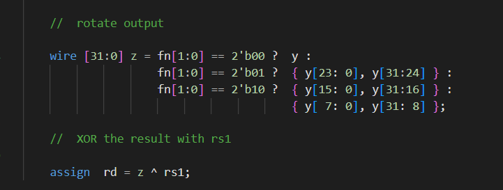


fn[1:0]

00  out= [3 1 1 2] X0

01  out= [1 1 2 3] X1

10  out= [1 2 3 1] X2

11  out= [2 3 1 1] X3


##### 汇编处理函数逻辑

```c
//	Encrypt rounds. Implements AES-128/192/256 depending on nr = {10,12,14}
//		void aes_enc_rounds(uint8_t ct[16], const uint8_t pt[16],
//							const uint32_t rk[], int nr)
//		where:	a0 = ct, a1 = pt, a2 = rk, a3 = nr
ct:加密过后的密文 a0
pt:明文         a1
rk:密钥         a2
nr:加密轮数      a3
```

##### saes32_encsm/saes32_encs

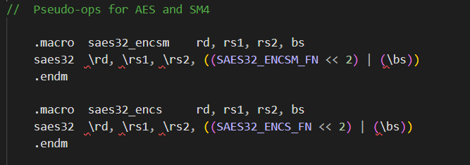


```assembly
aes_enc_rounds:

		lw		t4,		0(a1)				//	load pt
		lw		t5,		4(a1)
		lw		t6,		8(a1)
		lw		a7,		12(a1)

		lw		t0,		0(a2)				//	load rk
		lw		t1,		4(a2)
		lw		t2,		8(a2)
		lw		t3,		12(a2)

		xor		t0,		t0,		t4			//	pt ^ rk
		xor		t1,		t1,		t5
		xor		t2,		t2,		t6
		xor		t3,		t3,		a7

		slli	a3,		a3,		4			//	final pointer  逻辑左移
		add		a3,		a3,		a2

		j		.ent						//	enter loop in the middle

.loop:
		//	odd round   这里T4 T5 T6 A7为上一步结果，对其操作
		saes32_encsm	T0, T0, T4, 0
		saes32_encsm	T0, T0, T5, 1
		saes32_encsm	T0, T0, T6, 2
		saes32_encsm	T0, T0, A7, 3

		saes32_encsm	T1, T1, T5, 0
		saes32_encsm	T1, T1, T6, 1
		saes32_encsm	T1, T1, A7, 2
		saes32_encsm	T1, T1, T4, 3

		saes32_encsm	T2, T2, T6, 0
		saes32_encsm	T2, T2, A7, 1
		saes32_encsm	T2, T2, T4, 2
		saes32_encsm	T2, T2, T5, 3

		saes32_encsm	T3, T3, A7, 0
		saes32_encsm	T3, T3, T4, 1
		saes32_encsm	T3, T3, T5, 2
		saes32_encsm	T3, T3, T6, 3

.ent:
		lw		t4,		16(a2)				//	load round key
		lw		t5,		20(a2)
		lw		t6,		24(a2)
		lw		a7,		28(a2)

		//	even round    这里包含了shiftrows操作  传入aes32协处理器 这里T0 T1 T2 T3为上一步的结果，结果传输到 T4 T5 T6 A7里面
		saes32_encsm	T4, T4, T0, 0
		saes32_encsm	T4, T4, T1, 1
		saes32_encsm	T4, T4, T2, 2
		saes32_encsm	T4, T4, T3, 3

		saes32_encsm	T5, T5, T1, 0
		saes32_encsm	T5, T5, T2, 1
		saes32_encsm	T5, T5, T3, 2
		saes32_encsm	T5, T5, T0, 3

		saes32_encsm	T6, T6, T2, 0
		saes32_encsm	T6, T6, T3, 1
		saes32_encsm	T6, T6, T0, 2
		saes32_encsm	T6, T6, T1, 3

		saes32_encsm	A7, A7, T3, 0
		saes32_encsm	A7, A7, T0, 1
		saes32_encsm	A7, A7, T1, 2
		saes32_encsm	A7, A7, T2, 3

		addi	a2,		a2,		32   //切换下一次key +32地址
		lw		t0,		0(a2)				//	load round key
		lw		t1,		4(a2)
		lw		t2,		8(a2)
		lw		t3,		12(a2)
		bne		a3,		a2,		.loop  //判断是否进入loop

		//	final (output) round  取消mixcolumn操作
		saes32_encs		T0, T0, T4, 0
		saes32_encs		T0, T0, T5, 1
		saes32_encs		T0, T0, T6, 2
		saes32_encs		T0, T0, A7, 3

		saes32_encs		T1, T1, T5, 0
		saes32_encs		T1, T1, T6, 1
		saes32_encs		T1, T1, A7, 2
		saes32_encs		T1, T1, T4, 3

		saes32_encs		T2, T2, T6, 0
		saes32_encs		T2, T2, A7, 1
		saes32_encs		T2, T2, T4, 2
		saes32_encs		T2, T2, T5, 3

		saes32_encs		T3, T3, A7, 0
		saes32_encs		T3, T3, T4, 1
		saes32_encs		T3, T3, T5, 2
		saes32_encs		T3, T3, T6, 3

		sw		t0,		0(a0)				//	store ct
		sw		t1,		4(a0)
		sw		t2,		8(a0)
		sw		t3,		12(a0)

		jr		ra
		.size	aes_enc_rounds,	 .-aes_enc_rounds
```

#### 5、构建系统aes32仿真

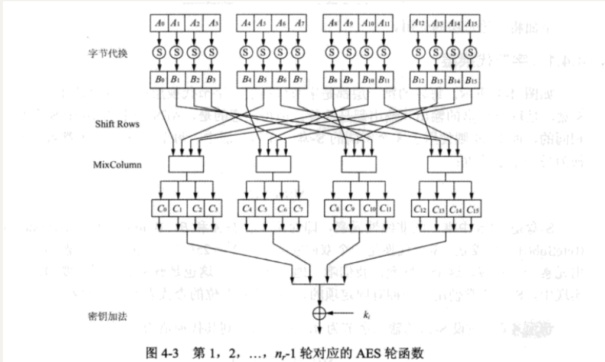

使用参数

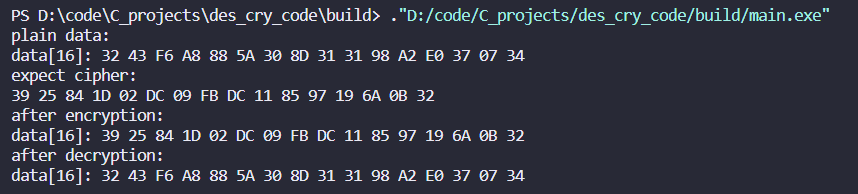


  const uint8_t key[16] = {0x2b, 0x7e, 0x15, 0x16, 0x28, 0xae, 0xd2, 0xa6, 0xab, 0xf7, 0x15, 0x88, 0x09, 0xcf, 0x4f, 0x3c};

  const uint8_t pt[16]={0x32, 0x43, 0xf6, 0xa8, 0x88, 0x5a, 0x30, 0x8d, 0x31, 0x31, 0x98, 0xa2, 0xe0, 0x37, 0x07, 0x34};


##### 明文：

plain = 3243f6a8885a308d313198a2e0370734

##### key数据

```c
key_1=2b7e151628aed2a6abf7158809cf4f3c
key_2=a0fafe1788542cb123a339392a6c7605
key_3=f2c295f27a96b9435935807a7359f67f
key_4=3d80477d4716fe3e1e237e446d7a883b
key_5=ef44a541a8525b7fb671253bdb0bad00
key_6=d4d1c6f87c839d87caf2b8bc11f915bc
key_7=6d88a37a110b3efddbf98641ca0093fd
key_8=4e54f70e5f5fc9f384a64fb24ea6dc4f
key_9=ead27321b58dbad2312bf5607f8d292f
key_10=ac7766f319fadc2128d12941575c006e
key_11=d014f9a8c9ee2589e13f0cc8b6630ca6
```


output=3925841D02DC09FBDC118597196A0B32

##### 编写testbench(小端存储)

```c
1、key_pt1[127:0]=key_1[127:0] xor pt[127:0]//得到key_pt1

2、saes32_encsm(key_2[31:0] ,key_2[31:0] ,key_pt1[31:0]  ,0 1 2 3)

3、saes32_encsm(key_2[63:32] ,key_2[63:32] ,key_pt1[63:32]  ,0 1 2 3)

4、saes32_encsm(key_2[95:64] ,key_2[95:64] ,key_pt1[95:64]  ,0 1 2 3)

5、saes32_encsm(key_2[127:96] ,key_2[127:96] ,key_pt1[127:96]  ,0 1 2 3)//得到key_2
    
6、saes32_encsm(key_3[31:0] ,key_3[31:0] ,key_2[31:0]  ,0 1 2 3)

7、saes32_encsm(key_3[63:32] ,key_3[63:32] ,key_2[63:32]  ,0 1 2 3)

8、saes32_encsm(key_3[95:64] ,key_3[95:64] ,key_2[95:64]  ,0 1 2 3)

9、saes32_encsm(key_3[127:96] ,key_3[127:96] ,key_2[127:96]  ,0 1 2 3)//得到key_3   
    
    
    
    
```


每轮加密数据理论输出

```c
time0=193de3bea0f4e22b9ac68d2ae9f84808
time1=a49c7ff2689f352b6b5bea43026a5049
time2=aa8f5f0361dde3ef82d24ad26832469a
time3=486c4eee671d9d0d4de3b138d65f58e7
time4=e0927fe8c86363c0d9b1355085b8be01
time5=f1006f55c1924cef7cc88b325db5d50c
time6=260e2e173d41b77de86472a9fdd28b25
time7=5a4142b11949dc1fa3e019657a8c040c
time8=ea835cf00445332d655d98ad8596b0c5
time9=eb40f21e592e38848ba113e71bc342d2
time11=3925841d02dc09fbdc118597196a0b32
```

实际输出

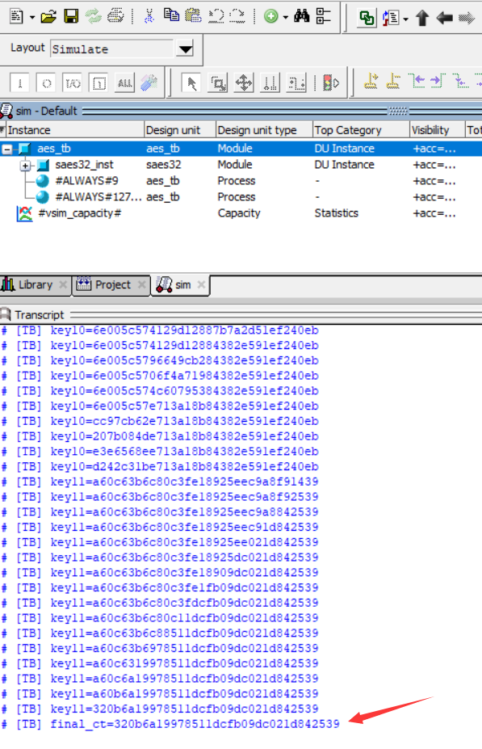


执行模块共16*10次 160次
