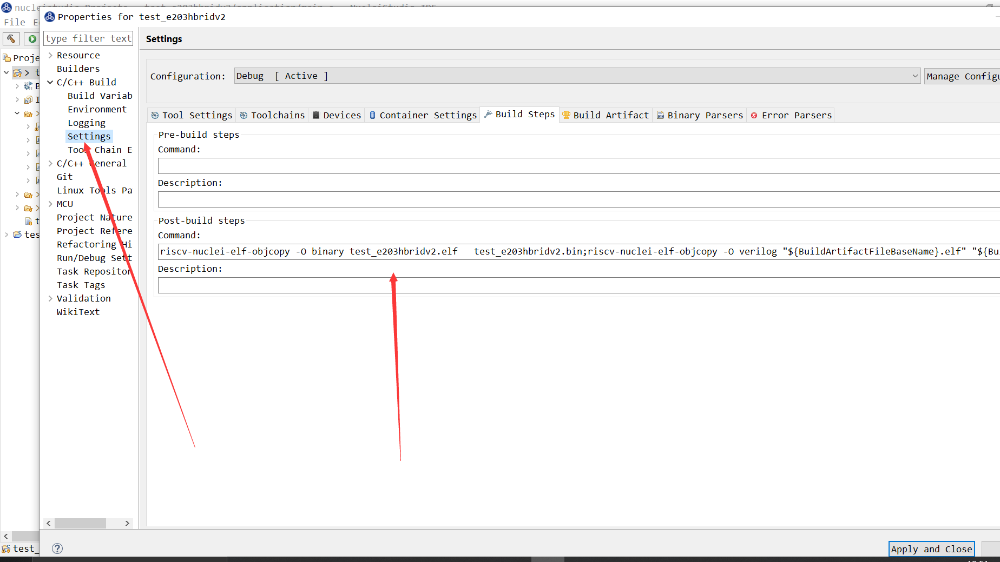

#### 采用IDE 


#### 工程设置里面添加




```c
riscv-nuclei-elf-objcopy -O binary test_e203hbridv2.elf   test_e203hbridv2.bin;riscv-nuclei-elf-objcopy -O verilog "${BuildArtifactFileBaseName}.elf" "${BuildArtifactFileBaseName}.verilog";sed -i 's/@800/@000/g' "${BuildArtifactFileBaseName}.verilog"; sed -i 's/@00002FB8/@00002000/g' "${BuildArtifactFileBaseName}.verilog";riscv-nuclei-elf-objdump -d  "${BuildArtifactFileBaseName}.elf" > "${BuildArtifactFileBaseName}.dasm";
```

